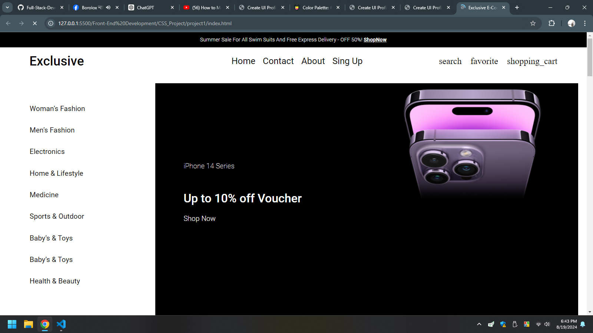
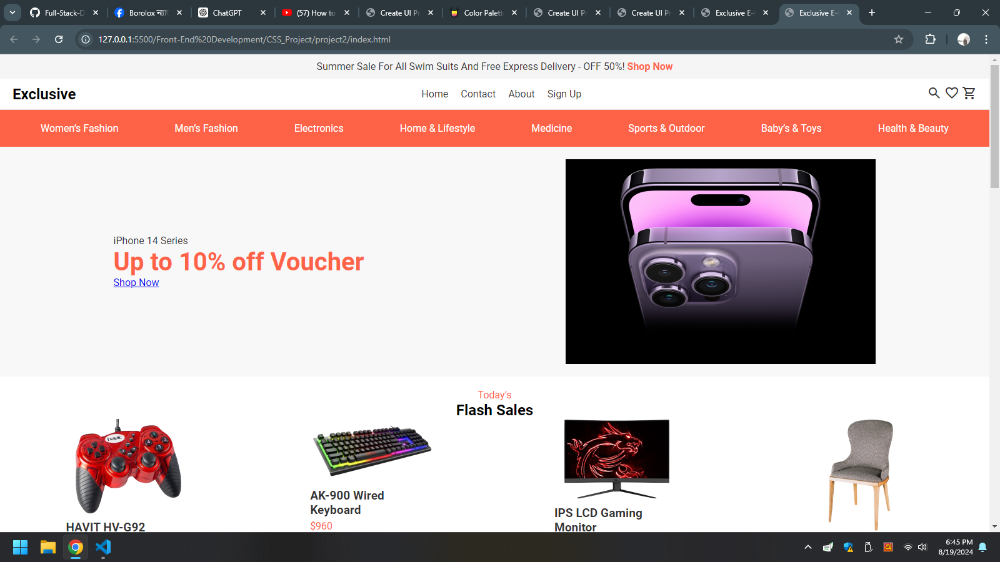
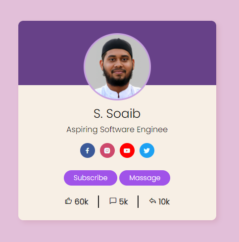

### Basic CSS

#### Introduction to CSS

**Cascading Style Sheets (CSS)** is a stylesheet language used to describe the presentation of a document written in HTML or XML. CSS defines how elements should be rendered on screen, on paper, in speech, or on other media.

#### Three Types of Stylesheets

1. **Internal Stylesheets**: Defined within a `<style>` tag inside the `<head>` section of an HTML document.
2. **External Stylesheets**: Linked to an HTML document using the `<link>` tag, allowing the CSS to be applied to multiple HTML documents.
3. **Inline Styles**: Added directly within an HTML element using the `style` attribute.

#### Ways to Add CSS

- **Inline CSS**: Uses the `style` attribute within HTML elements.
- **Internal CSS**: Uses the `<style>` tag within the `<head>` section of an HTML document.
- **External CSS**: Uses the `<link>` tag to link an external CSS file.

#### Selectors and Combinators

- **Selectors**: Patterns used to select elements to style. Examples include type selectors (e.g., `p`), class selectors (e.g., `.class`), and ID selectors (e.g., `#id`).
- **Combinators**: Relationships between selectors. Examples include descendant combinator (e.g., `div p`), child combinator (e.g., `div > p`), adjacent sibling combinator (e.g., `div + p`), and general sibling combinator (e.g., `div ~ p`).

#### CSS Specificity

Specificity determines which CSS rule is applied by the browser when multiple rules could apply to the same element. It is calculated based on the types of selectors used:

- Inline styles (highest specificity)
- ID selectors
- Class selectors, attribute selectors, and pseudo-classes
- Type selectors and pseudo-elements (lowest specificity)

#### Typography

CSS properties related to text styling, such as `font-family`, `font-size`, `font-weight`, `line-height`, `letter-spacing`, and `text-align`.

#### Box Model

The CSS box model represents the structure of an element. It consists of:

- **Content**: The actual content of the box.
- **Padding**: Space between the content and the border.
- **Border**: The border surrounding the padding (if any) and content.
- **Margin**: Space outside the border, separating the element from others.

#### Background Properties

CSS properties for setting background styles:

- `background-color`
- `background-image`
- `background-repeat`
- `background-position`
- `background-size`
- `background-attachment`

#### Basic Layout

CSS properties used for layout include:

- `display`
- `flex`
- `grid`

#### Float and Positioning

- **Float**: `float` property to position an element to the left or right.
- **Positioning**: Different positioning methods using `position` property values:
  - `static`
  - `relative`
  - `absolute`
  - `fixed`
  - `sticky`

#### Make a Card View

Creating a card view using HTML and CSS by styling elements to resemble a card layout.

#### Display Properties

CSS properties like `display`, `visibility`, `overflow`, etc., that control the display behavior of elements.

#### Transition Properties

CSS properties for animating changes to other properties:

- `transition-property`
- `transition-duration`
- `transition-timing-function`
- `transition-delay`

#### Transformation Properties

CSS properties for transforming elements:

- `transform`
- `transform-origin`

#### Responsiveness

Techniques to make web pages responsive, including media queries and flexible grid layouts.

#### CSS Variables

Custom properties (variables) in CSS that allow reusing values throughout a document:

- Declared using `--` (e.g., `--main-color: #06c;`)
- Used with `var()` function (e.g., `color: var(--main-color);`)

### Advanced CSS

#### Transition

CSS transitions allow smooth changes between property values. Properties include:

- `transition-property`: The property to be transitioned.
- `transition-duration`: The duration of the transition.
- `transition-timing-function`: The timing function for the transition (e.g., ease, linear).
- `transition-delay`: The delay before the transition starts.

#### Animation

CSS animations allow complex sequences of changes. Key properties include:

- `@keyframes`: Defines the animation.
- `animation-name`: The name of the keyframes to use.
- `animation-duration`: The duration of the animation.
- `animation-timing-function`: The timing function for the animation.
- `animation-delay`: The delay before the animation starts.
- `animation-iteration-count`: The number of times the animation should play.
- `animation-direction`: The direction of the animation (normal, reverse, alternate).

#### BEM Architecture

**Block Element Modifier (BEM)** is a methodology for naming CSS classes to make code more understandable and maintainable.

- **Block**: The standalone entity that is meaningful on its own (e.g., `menu`).
- **Element**: A part of a block that has no standalone meaning (e.g., `menu__item`).
- **Modifier**: A flag on a block or element that changes its appearance or behavior (e.g., `menu__item--active`).

These principles help in writing clear and scalable CSS.

### Additional Topics

#### Flexbox

Flexbox is a layout model that allows you to design complex layouts with ease. It provides an efficient way to distribute space and align items within a container.

#### Grid Layout

CSS Grid Layout is a two-dimensional layout system for the web. It allows you to design web pages using rows and columns, providing more control over the layout.

#### Pseudo-classes and Pseudo-elements

Pseudo-classes and pseudo-elements allow you to style specific parts of your elements.

- **Pseudo-classes**: `:hover`, `:active`, `:focus`, `:nth-child`, etc.
- **Pseudo-elements**: `::before`, `::after`, `::first-letter`, `::first-line`, etc.

#### CSS Frameworks

CSS frameworks like Bootstrap, Foundation, and Tailwind CSS provide pre-designed components and utilities, making it easier to build responsive and consistent web designs.

### Conclusion

CSS is a powerful tool for web design, enabling you to create visually appealing and responsive websites. Mastering CSS involves understanding its core concepts, selectors, properties, and advanced techniques like animations and responsive design. Practicing with real-world projects and exploring additional topics will help solidify your CSS skills.

### Projects

## Projects1 : Shop Display Website

## Projects2 : Shoping Website

## Projects3 : HTML Projects Add CSS

## Project4 : Profile-UI-Design

